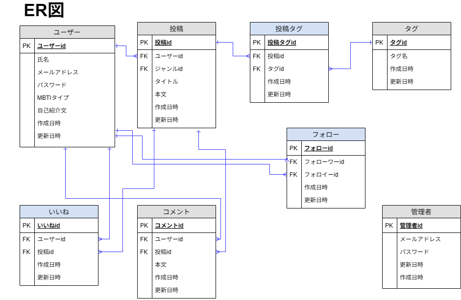
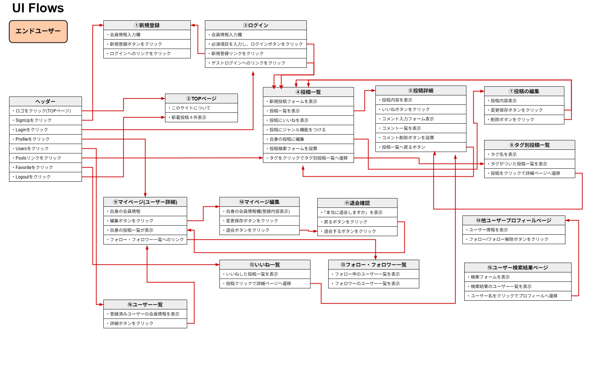
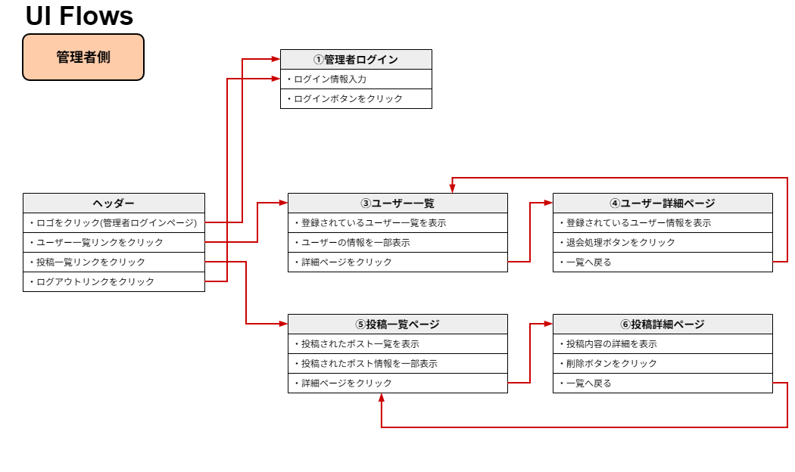

# TypeTalk
## サイト概要
### サイトテーマ
MBTIタイプ別に意見や日常を投稿・共有し、同じタイプへの共感や異なるタイプの価値観発見を楽しめるSNSサイト
​
### テーマを選んだ理由
SNS等で広く親しまれている「MBTI」を題材に、共感や交流を生むコミュニケーションツールの可能性に着目しました。
科学的根拠については諸説ありますが、エンターテインメントとしての需要は非常に高く、個々の考え方を共有できる特化型のサイトはまだ少ないと感じています。
利用者同士が楽しみながら交流できる場を形にしてみたいと考えました。

### ターゲットユーザ
・MBTIに関心があり、特定のタイプ特有の「あるある」や考え方に共感したい人
・自分とは異なるタイプが持つ価値観や視点を知りたい人
​
### 主な利用シーン
・自分のMBTIタイプの投稿に共感できる意見を探すとき
・他のタイプの考え方が気になって、ちょっと覗いてみたいとき
・友人とMBTIの話題で盛り上がり、もっと深堀したくなったとき

​
## 設計書
### ER図（データベース設計）

​
## 開発環境
- OS：Windows
- 言語：HTML,CSS,JavaScript,Ruby,SQL
- フレームワーク：Ruby on Rails
- JSライブラリ：jQuery
- IDE：Visual Studio Code（VSCode）
​
## 使用素材
<!-- - 外部サービスの画像素材・音声素材を使用した場合は、必ずサービス名とURLを明記してください。 -->
<!-- - アプリケーションの実装に使用したgem/bootstrapのリファレンスなどの記載は不要です。 -->
<!-- - 使用しない場合は、使用素材の項目をREADMEから削除してください。 -->
<!-- - 架空の団体・題材を前提にポートフォリオを制作する場合、下記のテンプレートを当項目内に記載しましょう。 -->
<!-- 【テンプレート】 -->
<!-- 著作権を考慮し、架空のデータを扱う予定です。 -->
<!-- なお今後、実在するデータを利用する際には、事前に著作権保持者と契約を結んだ上で利用します。 -->